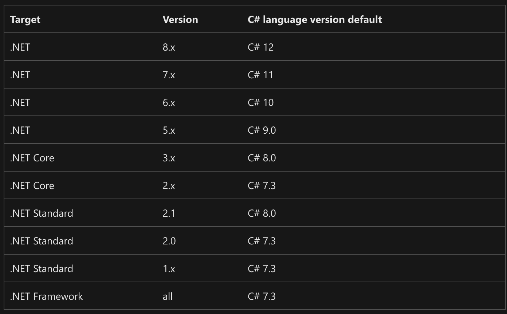

If you check an official [C# language versioning page](https://learn.microsoft.com/en-us/dotnet/csharp/language-reference/configure-language-version) you might think that there is a very strong relationship between the target framework and the C# language version.

And indeed, if you won't specify the C# language version implicitly in the project file the version would be picked based on the target framework: C# 12 for .net8, C#11 for .net7, and C# 7.3 for Full Framework:



And even though the mapping just specifies the defaults, some people believe that the mapping is fixed and, for instance, if you got stuck with Full Framework, you also got stuck with C# 7.3. But this is not the case.

The actual relationship between the C# language version and the target framework is more delicate.

There are 3 ways how the feature might relate to the target framework.

* **Just works**. Some features like enhanced pattern matching, readonly struct members, enhanced usings and static lambdas, just work out of the box. Just set the right `langVersion` and new feature works regardless of the target framework.
* **Requires a special type definition**. Other features, such as new interpolated strings, non-nullable types, ranges and many other language features requires special types to be discoverable by the compiler. These special types are added to .net core release that corresponds to particular C# version, but you can add them manually to your compilation (see examples below) to get a feature working.
* **Runtime specific**. And only a small fraction of all the new language features do require the runtime support. Features like Default Interface Implementations, Inline Arrays or ref fields won't compile if the target framework doesn't support it and if you'll try, you'll get an error: `Error CS9064 : Target runtime doesn't support ref fields`.

The first and the last cases are quite obvious, but the second one requires a bit of extra information. The C# compiler requires the special types to be available during compilation of the project if the feature is used, and it doesn't care where the type definition is coming from: it can come from the target framework, from a nuget package, or be part of the project itself.

Here is an example of using init-only setters (available since C# 9) in a project targeting netstandard 2.0:

```csharp
// Project targets netstandard2.0 or net472
public record MyRecord
{
    // System.Runtime.CompilerServices.IsExternalInit class is required.
    public int X { get; init; }
}

namespace System.Runtime.CompilerServices
{
    internal class IsExternalInit { }
}
```

But if you'll try to use some other features, like required members, the amount of manual work would be way higher:

```csharp
public record class MyRecord
{
    // System.Runtime.CompilerServices.IsExternalInit class is required.
    public int X { get; init; }
    // System.Runtime.CompilerServices.RequiredMemberAttribute,
    // CompilerFeatureRequiredAttribute and
    // System.Diagnostics.CodeAnalysis.SetsRequiredMembersAttribute are required
    public required int Y { get; set; }    
}

namespace System.Runtime.CompilerServices
{
    internal class IsExternalInit { }
    internal class RequiredMemberAttribute : System.Attribute { }
    internal sealed class CompilerFeatureRequiredAttribute(string featureName) : System.Attribute
    {
        public string FeatureName { get; set; } = featureName;
    }
}

namespace System.Diagnostics.CodeAnalysis
{
    internal class SetsRequiredMembersAttribute : System.Attribute { }
}
```

Adding all the attributes manually to every project is very tedious, so you can rely on some MSBuild magic to add a set of known files based on the target framework. Or you could just use something like [PolySharp](https://github.com/Sergio0694/PolySharp) that uses source generation to add all the required types regardless of the target framework.

# C# 12 Features

| Language Feature                                                                                                           | Requirements                        |
| -------------------------------------------------------------------------------------------------------------------------- | ----------------------------------- |
| [ref-readonly parameters](https://github.com/dotnet/csharplang/blob/main/proposals/csharp-12.0/ref-readonly-parameters.md) | No extra requirements(*)            |
| [Collection expressions](https://github.com/dotnet/csharplang/issues/5354)                                                 | No extra requirements               |
| [Interceptors](https://github.com/dotnet/csharplang/issues/7009)                                                           | `InterceptsLocationAttribute` (**)       |
| [Inline Arrays](https://github.com/dotnet/csharplang/blob/main/proposals/csharp-12.0/inline-arrays.md)                     | Runtime support is required: .net8+ |
| [nameof accessing instance members](https://github.com/dotnet/csharplang/issues/4037)                                      | No extra requirements               |
| [Using aliases for any types](https://github.com/dotnet/csharplang/issues/4284)                                            | No extra requirements               |
| [Primary Constructors](https://github.com/dotnet/csharplang/blob/main/proposals/csharp-12.0/primary-constructors.md)       | No extra requirements               |
| [Lambda optional parameters](https://github.com/dotnet/csharplang/issues/6051)                                             | No extra requirements               |
| [Experimental Attribute](https://github.com/dotnet/csharplang/blob/main/proposals/csharp-12.0/experimental-attribute.md)   | `ExperimentalAttribute` (***)         |

------
(*)
ref-readonly parameters is an interesting feature. On one hand, it doesn't require any extra types to be declared manually, but it does rely on an extra type - `System.Runtime.CompilerServices.RequiresLocationAttribute`. But if the compilation is missing this type, the compiler would generate it for you!

(**) The full type name is `System.Runtime.CompilerServices.InterceptsLocationAttribute`
(***) The full type name is `System.Diagnostics.CodeAnalysis.ExperimentalAttribute`

# C# 11 Features

| Language Feature | Requirements |
| ---------------- | ------------ |
|                  |              |


Here is a table with all the features from C# 8 to 12 with its category and the requirements, like, a special type or a runtime that started supporting it.
Here is a table that shows all the features for C# 8 to 12 and 

Let's say you're using the latest compiler (Feb 2023, the compiler suppoerts C# 12): 

This lead to a ton of confusion, since people might think that, for instance, if you target .NET Framework you have to stay with version 7.3. But you have to remember, that this
